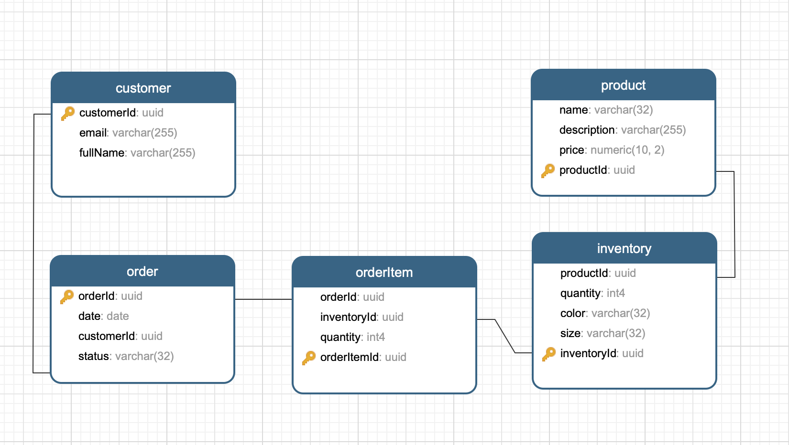

# Simple Order Service

## Overview

Build a service that allows customers to place orders via a REST API. We would like to be able to model the current inventory, deducting from inventory as orders are created, and adding inventory back if orders are canceled.

### Inventory records should include the following attributes:
1. Name
2. Description
3. Price
4. Quantity available

### Order records should include the following attributes:

1. Customer email address
2. Date order placed
3. Order status

For the purposes of this exercise, there are some design and implementation details that are intentionally left out. You should decide what to do in these cases, and be prepared to explain why you made these decisions during the interview.

## Requirements

### The service should include the following:

* Support CRUD operations for inventory
* Support CRUD operations for orders
* When creating, updating, or canceling an order, inventory should be adjusted accordingly.
* When a request to create an order is made, it will include a list of inventories to include in the order.
* If inventory levels are insufficient, a request to create an order should be denied.
* Tests should be included for both the inventory and order endpoints
* Authorization/authentication is NOT required for this service. It is safe to assume that all calls to the service should be processed
* Database models should be created based on your assessment of what’s necessary for the service. At minimum, you’ll likely want a model for inventory and a model for orders; you may choose to include additional models as necessary.

### For your implementation:

* Language: you can choose any language you would like to implement the service, though Java, Javascript, or Typescript are preferred.
* Database: you can choose any database you prefer
* Framework: you can choose any framework (or none at all) 

## Deliverables

Please send us the code that you develop so we can review what you’ve written. We will be evaluating you on the following, in approximate order:

* Correctness
* Cleanliness and clarity
* Efficiency

Please include high-level installation instructions. Your code should cleanly compile, tests should run without failures, and we should be able to make requests against your service.

ER diagrams and similar design elements are not required. Your code should make it sufficiently clear how models are defined and related.

## Expected request endpoints

### Inventories
1. POST http://localhost:3000/inventories Create inventory item
2. GET http://localhost:3000/inventories Read all inventory items
3. GET http://localhost:3000/inventories/1 Read single inventory item
4. PUT http://localhost:3000/inventories/1 Update inventory item 
5. DELETE http://localhost:3000/inventories/1 Delete inventory item


### Orders
1. POST http://localhost:3000/orders Create order
2. GET http://localhost:3000/orders Read all orders
3. GET http://localhost:3000/orders/1 Read single order
4. PUT http://localhost:3000/orders/1 Update order
5. DELETE http://localhost:3000/orders/1 Delete order


## Setup

### install packages

```bash
npm install
```

### install and start postgress 
```brew update
brew install postgresql
brew services start postgresql
```
Check your user name for Postgress and revise the config/db.ts
```psql postgres
postgres=# \du
```

Then, create a database and import resources/orderservice.sql into the new database.

### Development with nodemon and tsc --watch

```bash
npm run dev
```
Then visit `http://localhost:3000/swagger/#`

### Run without nodemon and tsc --watch

```bash
npm start
```
Then visit `http://localhost:3000/swagger/#`

## Design 


## Assumptions
 
* Customer is optional in this design, it can be eliminated based on the given requirements.

* Guid ID is the key in the DB, it should not expose to client side, because of simplicity, leave it out as is for now. 

* Inventory is splited up from Product because of the data domain. i.e. Lululemon commuter pants is the name of product, while its sizes and colors along with the quantity are stored in the invenotry.